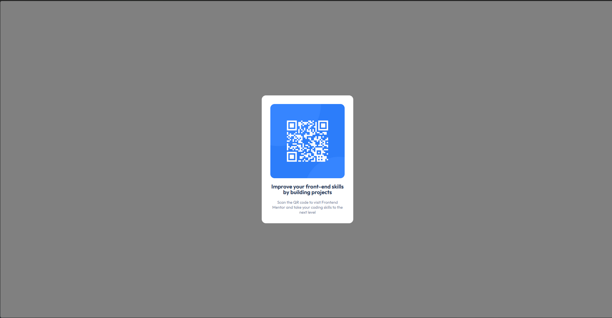

# Frontend Mentor - QR code component solution

This is a solution to the [QR code component challenge on Frontend Mentor](https://www.frontendmentor.io/challenges/qr-code-component-iux_sIO_H). Frontend Mentor challenges help you improve your coding skills by building realistic projects. 

## Table of contents

- [Overview](#overview)
  - [Screenshot](#screenshot)
  - [Links](#links)
- [My process](#my-process)
**Note: Delete this note and update the table of contents based on what sections you keep.**

## Overview

### Screenshot

### Links

Vercel: https://qr-code-ui-3nmr-535x2iexm-francis323s-projects.vercel.app/

## My process

I started searching for the Figma reference, i know that is a bad practice but i used inline styles to be more efficient in time, it take me like 30 minutes to develop everything.

### Built with

- Semantic HTML5 markup
- Vanilla CSS

